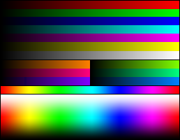
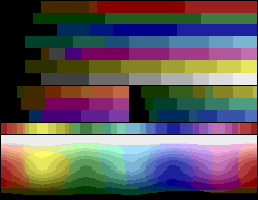
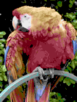
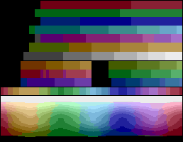
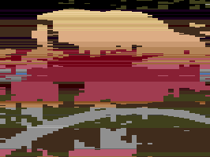
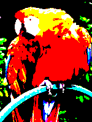
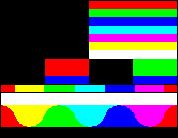

# Atari 2600

- [ ] Need to remember the scanline process (NTSC/PAL)
- [ ] Need to understand the actual TIA and 6507 interaction
- [ ] Need to chart out the OPCodes
- [ ] Need to understand more about the 6502/6507

## Coloring schemes for atari

Taking an original picture of a parrot.

### NTSC

The NTSC scheme has a total of 128 unique colors

### PAL

The PAL scheme has a total of 104 unique colors

### SECAM 

The SECAM scheme has 8 unique colors

You really wouldn't want to see the parrot in SECAM scheme

**Enocuntered a strange bug in stella I think where I actually have to input in
an extra whopping 46 commands just to stabilize the image in Stella.**

I might have to try out some other emulators to fix that
